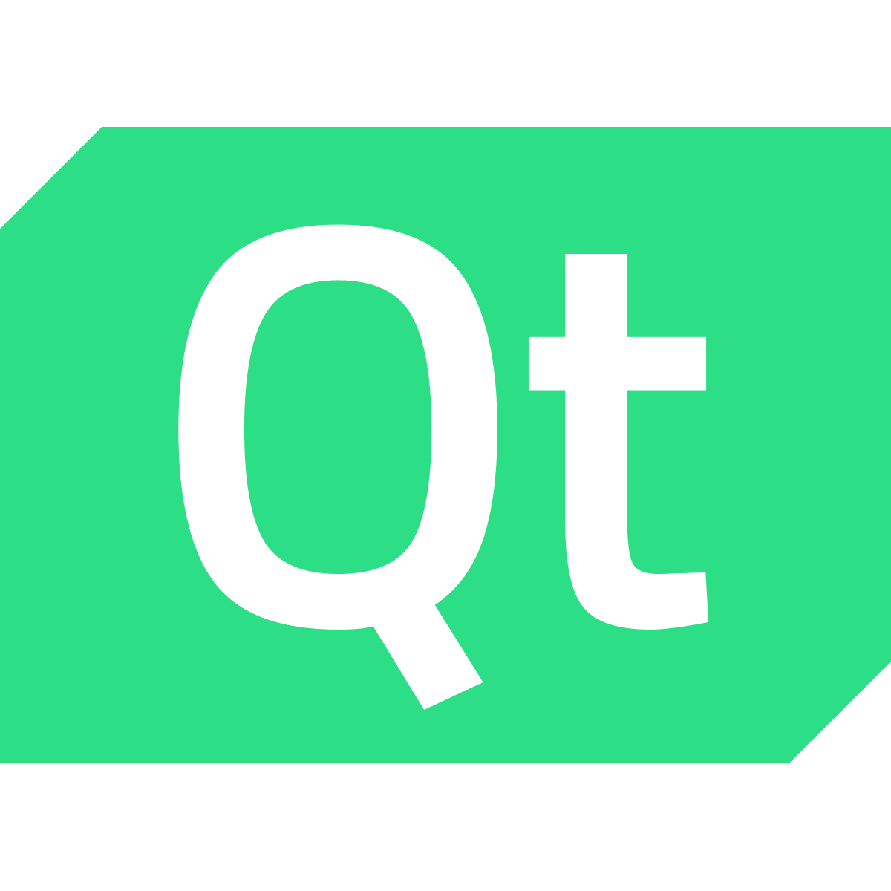

<!-- Forced into html for alignment... -->
<h1 align="center">Hi 👋, I'm Tyler</h1>
<h3 align="center">A software engineer from Hamilton NZ 🇳🇿</h3>

  

## About me

I help machines see and grade fruit that's being yeeted at 1.5 m/s. Area-scan applications will see ~350 fruit per second, with line-scan doubling that. I do a lot of prototyping through Python and OpenCV, then write production code as custom CUDA kernels and hook them up through C++.

## My tools
<!-- Forced into html for consistent image sizes... -->
      
